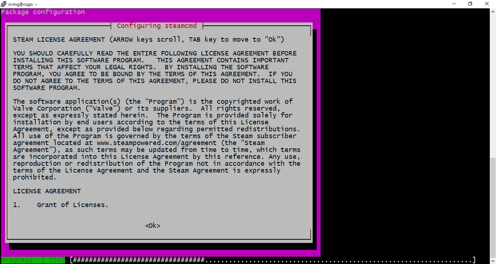

# Preparando seu ambiente
Para que possamos instalar um servidor de *Counter-Strike: Global Offensive*, precisamos antes preparar o nosso sistema operacional para recebê-lo. Para este guia, o SO utilizado será o [Ubuntu 20.04 LTS](https://releases.ubuntu.com/20.04/).

Caso você não utilize nenhuma distribuição Linux na sua máquina principal, você poderá adpatar esse processo para o Windows, mas tenha em mente que este tutorial será guiado para o uso em ambiente Linux, via terminal.

Se você está procurando uma forma de hospedar seu servidor na internet, consulte o (futuro) [guia de hospedagem na nuvem](). //em breve

## Requisitos de Hardware
Para que possamos executar um servidor de CS:GO, é necessário que tenhamos uma máquina capaz de prover respostas rápidas e confiáveis aos players conectados. Visto isso, é recomendado que ao executar seu servidor em uma máquina virtual(cloud/VPS), você escolha uma configuração parecida com essa ou superior:

- 1 vCPU ~3GHz
- 2GB RAM
- 30GB de espaço em disco

    **Essas especificações foram dimensionadas a partir das minhas experiências, onde tive a oportunidade de administrar um campeonato de CS:GO.**

Em algumas das minhas experiências tive a oportunidade de observar o comportamento de um servidor em uma máquina virtual `n1-standard-1` do [Google Cloud Platform](https://cloud.google.com/). Esse servidor abrigava partidas competitivas com 10 players e em média 3 espectadores por partida. O uso de CPU girava em torno de 80% e exigia pouco menos de 1GB da memória RAM.

Caso você queira testar o seu servidor em seu PC, tenha em mente que rodar o servidor e o jogo ao mesmo tempo demandará muito mais recursos.
## Requisitos de software
Existem algumas configurações que precisam ser feitas e alguns softwares que precisam ser instalados para que possamos ambientar o linux e então rodar nosso servidor.

### 1. Atualizando o sistema
Para garantir que a nossa distro linux está atualizada, precisamos executar os comandos que seguem. Esta linha irá atualizar o sistema:

```
sudo apt update && apt upgrade
```

Durante esse processo, você será questionado se deseja aplicar as atualizações. Digite Y e tecle enter.
Após o processo terminar, reinicie a sua máquina:

```
sudo systemctl reboot
```

O processo dura menos de um minuto e logo você poderá acessar novamente sua máquina virtual e prosseguir com este tutorial.

### 2. Instalando o SteamCMD
O [SteamCMD](https://developer.valvesoftware.com/wiki/Counter-Strike:_Global_Offensive_Dedicated_Servers) é a versão linha de comando do cliente da Steam. Com ele, somos capazes de instalar e atualizar os servidores de jogos disponíveis na Steam. Para instalá-lo, precisamos primeiro adicionar o repositório `multiverse` e então baixá-lo. Após o reinício da máquina virtual, execute os seguintes comandos em sequência:

```
sudo apt install software-properties-common

sudo add-apt-repository multiverse

sudo dpkg --add-architecture i386

sud apt update
```

E por fim, podemos instalar o SteamCMD:

```
sudo apt install steamcmd
```

Ao instalar, você será questionado se aceita os termos de uso. Ao aparecer o contrato, use o teclado para clicar em OK, aperte o `TAB` e em seguida o enter.

 

 Após isso, você escolherá a opção `I AGREE` e aperta enter.

Pronto, nosso sistema está pronto para instalarmos o servidor de CS:GO.

[<<< Primeiros passos](README.md) || [Instalando o servidor dedicado de CS:GO >>>](2-installing-server.md)


## Referências

- [CS:GO Wiki Homepage](https://developer.valvesoftware.com/wiki/Counter-Strike:_Global_Offensive_Dedicated_Servers)
- [Downloading SteamCMD](https://developer.valvesoftware.com/wiki/SteamCMD#Downloading_SteamCMD)